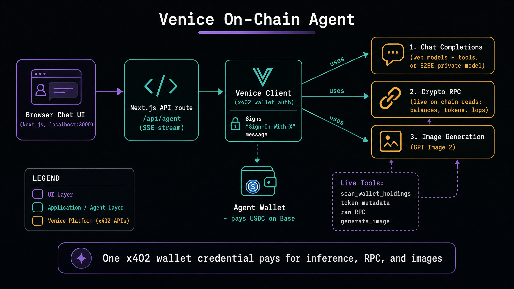

# Venice On-Chain Agent

A chat-first AI agent that reads the blockchain live and pays for everything with a
crypto wallet. Ask it about any wallet, token, or contract — it calls **Venice
Crypto RPC** tools on demand, reasons with a top web model (or a fully private
**E2EE** model), and can even generate images. Every Venice call — inference,
on-chain RPC, and image generation — is paid from a single wallet via **x402**.
No API key anywhere.



## Highlights

- **Chat-first & agentic.** One conversation. The agent decides when to read the
  chain and calls tools itself — re-reading live whenever you ask ("there's ETH now,
  check again" actually re-queries).
- **Powered by x402.** The agent signs a Sign-In-With-X message with its own wallet
  and pays in USDC (Base or Solana) for *all* Venice routes. No account, no API key.
- **Live on-chain tools** across 10 EVM chains via Venice Crypto RPC — batched
  holdings scan, token metadata, balances, and a raw JSON-RPC escape hatch.
- **Privacy when you want it.** Switch to a Venice **E2EE** model: prompts are
  encrypted client-side and only a verified TEE can read them (tools/web off).
- **Image generation** via Venice's image API (Grok Imagine High Quality), paid with
  the same wallet — e.g. "make an infographic of my holdings."

## Quick start

```bash
cp .env.example .env       # then set WALLET_PRIVATE_KEY (see below)
npm install
npm run dev                # http://localhost:3000
```

### Fund the agent wallet (x402)

Everything is paid from the wallet, so it needs spendable Venice balance — and
holding USDC isn't the same as having balance; you must run the x402 top-up once.

```bash
npm run keygen             # generate a fresh, disposable wallet; copy its key to .env
# send >= $5 USDC (Base) to the printed address, then:
npm run topup 5            # x402 handshake: converts USDC -> spendable Venice balance
npm run smoke              # verifies balance + a live Crypto RPC read + TEE attestation
```

### Configure `.env`

```bash
WALLET_PRIVATE_KEY=0x...          # the agent's wallet (use a disposable one)
E2EE_MODEL=e2ee-qwen3-5-122b-a10b # default private model
DEFAULT_NETWORK=base-mainnet
```

Prefer not to keep a raw key in `.env`? Use an encrypted keystore instead:

```bash
node scripts/encrypt-key.mjs 0xYOUR_KEY "a-strong-passphrase"
# .env:
KEYSTORE_PATH=./keystore.json
KEYSTORE_PASSPHRASE=a-strong-passphrase
```

## Try it

Open `http://localhost:3000` and ask, for example:

- `analyze 0xacfE6019Ed1A7Dc6f7B508C02d1b04ec88cC21bf on Base`
- `what tokens are in 0x... ?`
- `is this contract able to send transactions right now?`
- `generate an image of this wallet's holdings`

Pick a **Web** model for live tools + web search, or a **Private (E2EE)** model for
an encrypted, no-tools conversation.

## How it works

```
Browser chat ──▶ /api/agent (SSE) ──▶ VeniceClient (x402 wallet auth)
                                            │  signs Sign-In-With-X per call
        ┌───────────────────────────────────┼───────────────────────────────┐
        ▼                                    ▼                               ▼
  Chat Completions                     Crypto RPC                     Image Generation
  (web + tools, or E2EE)         (live balances, tokens, logs)      (Grok Imagine HQ)
```

The model is given on-chain **tools** and calls them across multiple rounds; the
server runs each tool, streams the result back, and loops until the model answers.
The same wallet credential pays for inference, RPC, and images.

## Project layout

| Path | Purpose |
|---|---|
| `app/page.tsx` | Chat UI (model/chain pickers, streaming, tool chips, images) |
| `app/api/agent/route.ts` | Agentic loop over SSE (tokens, tool calls, images) |
| `app/api/models/route.ts` | Live model catalog (web vs E2EE), real names |
| `app/api/health` · `app/api/attestation` | Wallet balance · live TEE attestation |
| `lib/venice/client.ts` | Unified Venice client — x402 auth, chat, E2EE, images |
| `lib/venice/x402.ts` | Sign-In-With-X header signing |
| `lib/venice/rpc.ts` | Crypto RPC client + batched wallet snapshot |
| `lib/venice/tools.ts` | On-chain tool schemas + execution |
| `lib/venice/e2ee.ts` | ECDH → HKDF → AES-GCM E2EE flow + attestation |
| `lib/venice/keystore.ts` | scrypt + AES-256-GCM encrypted key storage |
| `scripts/` | `keygen`, `encrypt-key`, `topup`, `smoke` |

## API routes

| Route | Purpose |
|---|---|
| `POST /api/agent` | `{messages, model, network}` → SSE: `token`, `tool_call`, `tool_result`, `image`, `done` |
| `GET /api/models` | Curated live model catalog (web + E2EE) with real names |
| `GET /api/health` | Auth mode + x402 wallet balance |
| `GET /api/attestation` | Verified TEE enclave for the E2EE model |

## Notes

- **All Venice calls are server-side** (`runtime = "nodejs"`). The wallet key never
  reaches the browser, and Venice only ever sees a SIWE signature — never the key.
- **Tool calling requires a web-capable model.** E2EE models can't use tools or web
  (encryption disables them), so E2EE runs as a private, no-tools chat.
- **x402 is the payment rail, not a read-chain.** Crypto RPC reads are EVM/Starknet
  only; Solana is supported for x402 *payment*, not for on-chain reads.
- **E2EE** uses secp256k1 ECDH → HKDF-SHA256 (`ecdsa_encryption`) → AES-256-GCM with
  a 32-byte attestation nonce, per Venice's spec; streaming is required.

## Security

- `.env*`, `*.key`, `keystore.json`, and `secrets/` are gitignored.
- Use a **dedicated, low-value wallet** for the agent — never your treasury.
- For production, hold the key in a **KMS / Vault / HSM** rather than `.env` or a
  keystore file, put the app behind auth + rate limiting, and fund via DIEM (VVV
  staking) for unattended operation or a capped x402 wallet.

## Tech

Next.js (App Router) · TypeScript · viem · ethers · siwe · `@noble/ciphers` ·
`@noble/hashes` · [Venice API](https://docs.venice.ai).

## License

MIT
